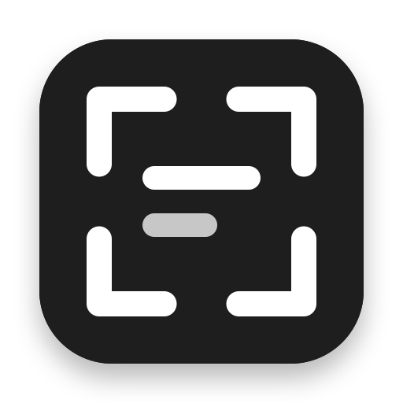

# Copas

A clipboard manager for macOS. Everything you copy, kept, searchable, and one
keystroke away.

Copas lives in the menu bar. Press **⇧⌘V** and a strip of cards drops down from
under the menu bar showing what you have copied, newest first, grouped by day.
Arrow to one, press Return, and it pastes into whatever you were just typing in.

**⇧⌘2** drags out a region of the screen and puts *the text in it* on your
clipboard — a receipt, an error dialog, a screenshot somebody sent you.

## What it does

- **Text and images**, with formatting preserved. Copy something bold out of a
  document and it pastes back bold.
- **Search that reaches the whole clip**, not just the first line — including
  text recognised inside pictures. Type anywhere on the board to start.
- **Reads text in images automatically**, on this Mac, as they arrive. A
  screenshot of a receipt is findable by what the receipt says.
- **Skips what it should.** Anything a password manager marks as concealed is
  never read, never hashed, and never written to disk. You can exclude other
  apps by hand.

## Keyboard

| | |
|---|---|
| `⇧⌘V` | Show the board |
| `⇧⌘2` | Capture a region of the screen as text |
| Type anything | Search |
| `←` `→` | Move between clips |
| `⌥←` `⌥→` | Jump a day at a time |
| `Home` `End` | First and last clip |
| `↩` | Paste into the app you came from |
| `⌘↩` | Copy without pasting |
| `⌘1`–`⌘9` | Paste the nth clip |
| `⌘Y` | Large preview |
| `⌘⌫` | Delete the focused clip |
| `⎋` | Close the preview, then the search, then the board |

## Search

Free text matches the clip, the text recognised in an image, and the app it came
from. Filters narrow it:

```
app:xcode              copied from Xcode
type:image             pictures only
type:text              text only
has:text invoice       pictures with recognised text mentioning "invoice"
```

Anything else with a colon in it — a URL, a `key: value` line you copied — is
searched for literally rather than treated as a filter.

## Privacy

Everything stays on your Mac. There is no account, no sync, and no analytics.
Text recognition runs locally through Vision. The only network request Copas ever
makes is to its own update feed.

Clips live in `~/Library/Application Support/Copas/`, unencrypted, readable by
anything running as you — the same as any clipboard manager. If that matters for
what you copy, exclude the app it comes from in Settings → History.

## Installing

Download the latest `.dmg` from
[Releases](https://github.com/sigitkusuma/copas/releases/latest) and drag Copas
to Applications. Builds are signed and notarised by Apple.

Copas asks for two permissions, and only when it first needs them:

- **Accessibility**, to press ⌘V for you. Without it the clip still lands on the
  clipboard and ⌘V by hand works.
- **Screen Recording**, for capture to text. Only when you first press ⇧⌘2.

Requires macOS 14 or later. Universal — Apple silicon and Intel.

## Building

```bash
brew install xcodegen
xcodegen generate
open Copas.xcodeproj
```

`project.yml` is the source of truth; `Copas.xcodeproj` is generated and not
checked in. See [CONTRIBUTING.md](CONTRIBUTING.md).

## Licence

MIT — see [LICENSE](LICENSE). Copas embeds
[Sparkle](https://sparkle-project.org) and [GRDB](https://github.com/groue/GRDB.swift),
both MIT licensed.
