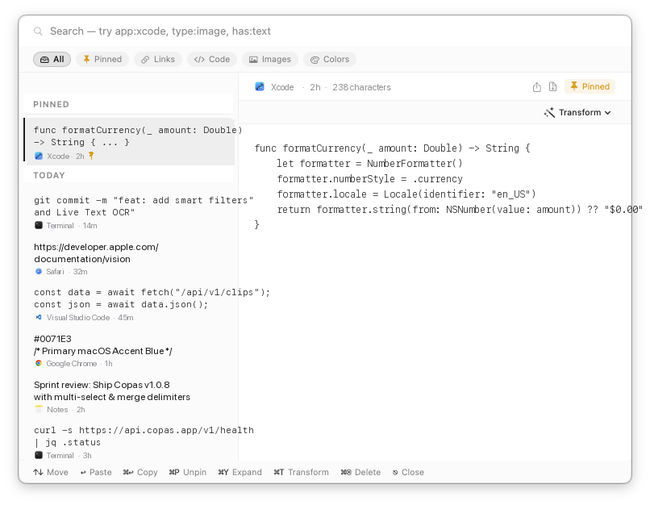

<style>
  :root {
    --copas-primary: #0071e3;
    --copas-primary-hover: #0077ed;
    --copas-bg-card: #ffffff;
    --copas-border-card: #e5e7eb;
    --copas-text-muted: #6b7280;
    --copas-badge-bg: #f3f4f6;
    --copas-badge-text: #374151;
    --copas-kbd-bg: #f8fafc;
    --copas-kbd-border: #cbd5e1;
    --copas-kbd-text: #1e293b;
    --copas-shadow: 0 10px 25px -5px rgba(0, 0, 0, 0.08), 0 8px 10px -6px rgba(0, 0, 0, 0.04);
    --copas-hero-gradient: linear-gradient(180deg, rgba(0,113,227,0.06) 0%, rgba(255,255,255,0) 100%);
  }

  @media (prefers-color-scheme: dark) {
    :root {
      --copas-primary: #2997ff;
      --copas-primary-hover: #47a6ff;
      --copas-bg-card: #1c1c1e;
      --copas-border-card: #2c2c2e;
      --copas-text-muted: #98989d;
      --copas-badge-bg: #2c2c2e;
      --copas-badge-text: #e5e5ea;
      --copas-kbd-bg: #2c2c2e;
      --copas-kbd-border: #3a3a3c;
      --copas-kbd-text: #f2f2f7;
      --copas-shadow: 0 10px 30px -5px rgba(0, 0, 0, 0.4);
      --copas-hero-gradient: linear-gradient(180deg, rgba(41,151,255,0.12) 0%, rgba(0,0,0,0) 100%);
    }
  }

  /* Reset container spacing for clean aesthetic */
  .container-lg {
    max-width: 960px !important;
  }

  .copas-hero {
    text-align: center;
    padding: 3.5rem 1.5rem 2.5rem;
    margin-bottom: 2rem;
    border-radius: 24px;
    background: var(--copas-hero-gradient);
  }

  .copas-app-icon {
    width: 104px;
    height: 104px;
    border-radius: 23px;
    box-shadow: 0 16px 36px rgba(0,0,0,0.18);
    transition: transform 0.25s ease;
    margin-bottom: 1.25rem;
  }

  .copas-app-icon:hover {
    transform: translateY(-4px) scale(1.03);
  }

  .copas-title {
    font-size: 2.75rem !important;
    font-weight: 700 !important;
    letter-spacing: -0.04em !important;
    line-height: 1.15 !important;
    margin-top: 0 !important;
    margin-bottom: 0.5rem !important;
    border-bottom: none !important;
  }

  .copas-subtitle {
    font-size: 1.25rem;
    font-weight: 400;
    color: var(--copas-text-muted);
    max-width: 620px;
    margin: 0.5rem auto 1.5rem auto;
    line-height: 1.5;
  }

  .copas-badge-row {
    display: flex;
    flex-wrap: wrap;
    justify-content: center;
    gap: 0.5rem;
    margin-bottom: 2rem;
  }

  .copas-badge {
    display: inline-flex;
    align-items: center;
    gap: 0.35rem;
    font-size: 0.8125rem;
    font-weight: 500;
    padding: 0.3rem 0.75rem;
    border-radius: 9999px;
    background-color: var(--copas-badge-bg);
    color: var(--copas-badge-text);
    border: 1px solid var(--copas-border-card);
    text-decoration: none !important;
  }

  .copas-cta-group {
    display: flex;
    flex-wrap: wrap;
    justify-content: center;
    gap: 1rem;
    margin-bottom: 1rem;
  }

  .copas-btn {
    display: inline-flex;
    align-items: center;
    justify-content: center;
    gap: 0.5rem;
    font-size: 0.975rem;
    font-weight: 600;
    padding: 0.75rem 1.6rem;
    border-radius: 12px;
    text-decoration: none !important;
    transition: all 0.2s ease;
    cursor: pointer;
  }

  .copas-btn-primary {
    background-color: var(--copas-primary);
    color: #ffffff !important;
    box-shadow: 0 4px 14px rgba(0, 113, 227, 0.35);
  }

  .copas-btn-primary:hover {
    background-color: var(--copas-primary-hover);
    transform: translateY(-2px);
    box-shadow: 0 6px 20px rgba(0, 113, 227, 0.45);
  }

  .copas-btn-secondary {
    background-color: var(--copas-badge-bg);
    color: var(--copas-badge-text) !important;
    border: 1px solid var(--copas-border-card);
  }

  .copas-btn-secondary:hover {
    transform: translateY(-2px);
    border-color: var(--copas-text-muted);
  }

  .copas-window-frame {
    position: relative;
    border-radius: 16px;
    overflow: hidden;
    background-color: var(--copas-bg-card);
    border: 1px solid var(--copas-border-card);
    box-shadow: var(--copas-shadow);
    margin: 2.5rem 0 3.5rem 0;
  }

  .copas-window-titlebar {
    display: flex;
    align-items: center;
    padding: 0.75rem 1rem;
    background-color: rgba(127, 127, 127, 0.08);
    border-bottom: 1px solid var(--copas-border-card);
  }

  .copas-window-dots {
    display: flex;
    gap: 6px;
  }

  .copas-dot {
    width: 11px;
    height: 11px;
    border-radius: 50%;
  }

  .copas-dot-red { background: #ff5f56; }
  .copas-dot-yellow { background: #ffbd2e; }
  .copas-dot-green { background: #27c93f; }

  .copas-window-title {
    flex-grow: 1;
    text-align: center;
    font-size: 0.8125rem;
    color: var(--copas-text-muted);
    font-weight: 500;
    margin-right: 42px; /* Balance the dots */
  }

  .copas-window-frame img {
    display: block;
    width: 100%;
    height: auto;
  }

  .copas-features-grid {
    display: grid;
    grid-template-columns: repeat(auto-fit, minmax(280px, 1fr));
    gap: 1.25rem;
    margin: 2rem 0;
  }

  .copas-card {
    background-color: var(--copas-bg-card);
    border: 1px solid var(--copas-border-card);
    border-radius: 14px;
    padding: 1.35rem 1.4rem;
    box-shadow: 0 2px 8px rgba(0,0,0,0.03);
    transition: transform 0.2s ease, border-color 0.2s ease;
  }

  .copas-card:hover {
    transform: translateY(-2px);
    border-color: var(--copas-primary);
  }

  .copas-card-icon {
    font-size: 1.5rem;
    line-height: 1;
    margin-bottom: 0.75rem;
  }

  .copas-card h3 {
    margin-top: 0 !important;
    margin-bottom: 0.4rem !important;
    font-size: 1.05rem !important;
    font-weight: 600 !important;
    border-bottom: none !important;
  }

  .copas-card p {
    font-size: 0.9rem;
    color: var(--copas-text-muted);
    margin: 0 !important;
    line-height: 1.45;
  }

  .copas-kbd {
    display: inline-block;
    padding: 0.15rem 0.4rem;
    font-size: 0.775rem;
    font-family: ui-monospace, SFMono-Regular, "SF Mono", Menlo, Consolas, monospace;
    line-height: 1.2;
    color: var(--copas-kbd-text);
    background-color: var(--copas-kbd-bg);
    border: 1px solid var(--copas-kbd-border);
    border-radius: 6px;
    box-shadow: 0 1px 1px rgba(0, 0, 0, 0.1);
  }

  .copas-callout {
    border-left: 4px solid var(--copas-primary);
    background-color: var(--copas-badge-bg);
    padding: 1rem 1.25rem;
    border-radius: 0 10px 10px 0;
    margin: 1.5rem 0;
  }

  .copas-callout p {
    margin: 0 !important;
    font-size: 0.925rem;
  }
</style>

<div class="copas-hero">
  
  <h1 class="copas-title">Copas</h1>
  <p class="copas-subtitle">
    A native, fast, and privacy-first clipboard manager for macOS.<br />
    Everything you copy, kept, searchable, and one keystroke away.
  </p>

  <div class="copas-badge-row">
    <span class="copas-badge"> macOS 14+ Sonoma & Sequoia</span>
    <span class="copas-badge">⚡️ Universal (Apple Silicon & Intel)</span>
    <span class="copas-badge">🔒 100% On-Device & Private</span>
    <span class="copas-badge">📖 Free & Open Source (MIT)</span>
    <span class="copas-badge">🛡️ Signed & Notarized by Apple</span>
  </div>

  <div class="copas-cta-group">
    <a href="https://github.com/sigitkusuma/copas/releases/latest" class="copas-btn copas-btn-primary">
      <svg width="18" height="18" viewBox="0 0 24 24" fill="none" stroke="currentColor" stroke-width="2.2" stroke-linecap="round" stroke-linejoin="round"><path d="M21 15v4a2 2 0 0 1-2 2H5a2 2 0 0 1-2-2v-4"/><polyline points="7 10 12 15 17 10"/><line x1="12" y1="15" x2="12" y2="3"/></svg>
      Download Latest Release
    </a>
    <a href="https://github.com/sigitkusuma/copas" class="copas-btn copas-btn-secondary">
      <svg width="18" height="18" viewBox="0 0 24 24" fill="currentColor"><path fill-rule="evenodd" clip-rule="evenodd" d="M12 2C6.477 2 2 6.484 2 12.017c0 4.425 2.865 8.18 6.839 9.504.5.092.682-.217.682-.483 0-.237-.008-.868-.013-1.703-2.782.605-3.369-1.343-3.369-1.343-.454-1.158-1.11-1.466-1.11-1.466-.908-.62.069-.608.069-.608 1.003.07 1.53 1.032 1.53 1.032.892 1.53 2.341 1.088 2.91.832.092-.647.35-1.088.636-1.338-2.22-.253-4.555-1.113-4.555-4.951 0-1.093.39-1.988 1.029-2.688-.103-.253-.446-1.272.098-2.65 0 0 .84-.27 2.75 1.026A9.564 9.564 0 0112 6.844c.85.004 1.705.115 2.504.337 1.909-1.296 2.747-1.027 2.747-1.027.546 1.379.202 2.398.1 2.651.64.7 1.028 1.595 1.028 2.688 0 3.848-2.339 4.695-4.566 4.943.359.309.678.92.678 1.855 0 1.338-.012 2.419-.012 2.747 0 .268.18.58.688.482A10.019 10.019 0 0022 12.017C22 6.484 17.522 2 12 2z"/></svg>
      Star on GitHub
    </a>
  </div>
</div>

<div class="copas-window-frame">
  <div class="copas-window-titlebar">
    <div class="copas-window-dots">
      <span class="copas-dot copas-dot-red"></span>
      <span class="copas-dot copas-dot-yellow"></span>
      <span class="copas-dot copas-dot-green"></span>
    </div>
    <span class="copas-window-title">Copas Board — ⇧⌘V</span>
  </div>
  
</div>

---

## Why Copas?

Copas lives discreetly in your menu bar. When you need something you copied earlier, press <span class="copas-kbd">⇧⌘V</span>:

- **Everything in one place**: Text, formatted rich text, code snippets, colors, and pictures — listed chronologically down the board and grouped by day.
- **Instant paste**: Arrow to any clip or click it, press <span class="copas-kbd">↩ Return</span>, and it pastes straight into whatever you were just typing in.
- **Instant search**: Start typing anywhere on the board to search across your whole history, including text recognised inside screenshots.

---

## Features

<div class="copas-features-grid">
  <div class="copas-card">
    <div class="copas-card-icon">🔍</div>
    <h3>Deep Search & Live Text OCR</h3>
    <p>Searches full clip content and source apps. Recognises text inside screenshots and pictures on-device via Apple Vision, so receipts and error dialogs are findable by what they say.</p>
  </div>

  <div class="copas-card">
    <div class="copas-card-icon">📸</div>
    <h3>Screen to Image or Text</h3>
    <p>Capture any screen region directly. Press <span class="copas-kbd">⇧⌘1</span> for an image clip, or <span class="copas-kbd">⇧⌘2</span> to extract the text straight to your clipboard.</p>
  </div>

  <div class="copas-card">
    <div class="copas-card-icon">📌</div>
    <h3>Pinned Clips</h3>
    <p>Pin essential code snippets, boilerplate, or addresses with <span class="copas-kbd">⌘P</span>. Pinned clips stay permanently at the top of your board, immune to retention pruning.</p>
  </div>

  <div class="copas-card">
    <div class="copas-card-icon">🏷️</div>
    <h3>Smart Filter Pills</h3>
    <p>Filter instantly with one click or shortcuts: All (<span class="copas-kbd">⌘⌥0</span>), Pinned (<span class="copas-kbd">⌘⌥1</span>), Links (<span class="copas-kbd">⌘⌥2</span>), Code (<span class="copas-kbd">⌘⌥3</span>), Images (<span class="copas-kbd">⌘⌥4</span>), or Colors (<span class="copas-kbd">⌘⌥5</span>).</p>
  </div>

  <div class="copas-card">
    <div class="copas-card-icon">🪄</div>
    <h3>15 Text Transforms</h3>
    <p>Press <span class="copas-kbd">⌘T</span> to clean or format snippets on the fly: Case conversion, JSON formatting, URL/Base64 encoding, HTML escaping, line sorting, and duplicate removal.</p>
  </div>

  <div class="copas-card">
    <div class="copas-card-icon">🔀</div>
    <h3>Multi-Select & Merge</h3>
    <p>Select multiple clips with ⌘-click or Shift-click. Press <span class="copas-kbd">⌘M</span> to merge them using custom delimiters (newlines, commas, tabs, spaces) or export as a file.</p>
  </div>

  <div class="copas-card">
    <div class="copas-card-icon">📌</div>
    <h3>Pin-to-Screen Scratchpad</h3>
    <p>Press <span class="copas-kbd">⌘⇧P</span> to keep Copas floating on screen. Effortlessly paste multiple clips sequentially into documents or spreadsheets without the board dismissing.</p>
  </div>

  <div class="copas-card">
    <div class="copas-card-icon">🎯</div>
    <h3>Draggable Window</h3>
    <p>Move the Copas board anywhere on screen across displays using the top capsule drag handle, search bar margins, or bottom status bar.</p>
  </div>

  <div class="copas-card">
    <div class="copas-card-icon">🖱️</div>
    <h3>Direct Drag & Drop</h3>
    <p>Drag images or text clips directly from the board into Finder, Slack, Discord, Mail, Figma, or web editors without closing the window.</p>
  </div>

  <div class="copas-card">
    <div class="copas-card-icon">📤</div>
    <h3>Native Sharing & Export</h3>
    <p>Right-click any clip to Share via AirDrop, Messages, Mail, Notes, or Reminders, or export to disk as <code>.txt</code>, <code>.json</code>, <code>.md</code>, or <code>.png</code>.</p>
  </div>

  <div class="copas-card">
    <div class="copas-card-icon">📊</div>
    <h3>Insights & Storage Stats</h3>
    <p>Explore your clipboard statistics in Settings: text vs. image breakdown, storage footprint, and top source applications.</p>
  </div>
</div>

---

## Privacy by Design

Copas is engineered from the ground up to respect your privacy:

- **100% On-Device**: Zero accounts, zero sync, zero trackers, and zero telemetry.
- **Private Content Shield**: Anything copied from password managers (such as 1Password, Bitwarden, Apple Keychain) or marked as concealed is **never read, never hashed, and never written to disk**.
- **App Exclusion**: Exclude any sensitive app manually in Settings → History.
- **Local OCR**: Optical character recognition is processed strictly on your Mac using native macOS Vision and Live Text APIs.

---

## Keyboard Shortcuts

| Shortcut | Action |
|---|---|
| <span class="copas-kbd">⇧⌘V</span> | Show / toggle the Copas board |
| <span class="copas-kbd">⇧⌘1</span> | Capture screen region as image |
| <span class="copas-kbd">⇧⌘2</span> | Capture screen region and extract text to clipboard |
| *Type anywhere* | Search clips and OCR image text |
| <span class="copas-kbd">↑</span> <span class="copas-kbd">↓</span> | Move between clips |
| <span class="copas-kbd">⌥↑</span> <span class="copas-kbd">⌥↓</span> | Jump a day at a time |
| <span class="copas-kbd">↩ Return</span> | Paste into active app |
| <span class="copas-kbd">⌘↩</span> | Copy to clipboard without pasting |
| <span class="copas-kbd">⌘1</span> – <span class="copas-kbd">⌘9</span> | Paste the *n*th clip immediately |
| <span class="copas-kbd">⌘⇧P</span> | Pin or unpin board to screen (scratchpad mode) |
| <span class="copas-kbd">⌘P</span> | Pin or unpin focused clip |
| <span class="copas-kbd">⌘M</span> | Merge selected clips |
| <span class="copas-kbd">⌘T</span> | Open text transform menu |
| <span class="copas-kbd">⌘S</span> | Save edited clip |
| <span class="copas-kbd">Space</span> / <span class="copas-kbd">⌘Y</span> | Quick Look / expand clip preview |
| <span class="copas-kbd">⌘⌫</span> | Delete focused or selected clips |
| <span class="copas-kbd">⌘⌥0</span> – <span class="copas-kbd">⌘⌥5</span> | Filter: All (`0`), Pinned (`1`), Links (`2`), Code (`3`), Images (`4`), Colors (`5`) |
| <span class="copas-kbd">⌘,</span> | Open Preferences / Settings |
| <span class="copas-kbd">Esc</span> | Clear search / selection, or dismiss board |

---

## Installation & Requirements

### System Requirements
- **macOS 14.0 (Sonoma)** or later (fully compatible with macOS 15 Sequoia)
- **Universal Binary**: Runs natively on Apple Silicon (M1/M2/M3/M4) and Intel Macs

### Install via DMG
1. Download the latest release `.dmg` from [GitHub Releases](https://github.com/sigitkusuma/copas/releases/latest).
2. Open the disk image and drag **Copas.app** to your **Applications** folder.
3. Launch Copas from Applications or Spotlight.

### Permissions
Copas prompts for permissions only when needed:
- **Accessibility**: Required to simulate <span class="copas-kbd">⌘V</span> for instant pasting into your active application.
- **Screen Recording**: Optional; requested only when you trigger screen region capture (<span class="copas-kbd">⇧⌘1</span> or <span class="copas-kbd">⇧⌘2</span>).

---

## Updates & Appcast Feed

Copas includes automatic update support powered by [Sparkle](https://sparkle-project.org/). Updates are notarized by Apple and cryptographically signed with EdDSA.

The permanent update feed is hosted on this site:
```text
https://sigitkusuma.github.io/copas/appcast.xml
```

You can check for updates manually at any time via **Copas Menu Bar Icon → Check for Updates…**.

---

## Building from Source

```bash
# Clone the repository
git clone https://github.com/sigitkusuma/copas.git
cd copas

# Generate Xcode project with XcodeGen
brew install xcodegen
xcodegen generate

# Open and build
open Copas.xcodeproj
```

See [CONTRIBUTING.md](https://github.com/sigitkusuma/copas/blob/main/CONTRIBUTING.md) for code style guidelines and test suite details.

---

## License

Copas is free and open source software released under the [MIT License](https://github.com/sigitkusuma/copas/blob/main/LICENSE).
